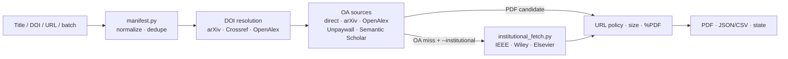

# oa-paper-fetch

[简体中文](README.zh-CN.md) | **English**

[](LICENSE)
[](#cli-reference)

> Title / DOI / URL → PDF files + JSON/CSV reports.

`oa-paper-fetch` confirms paper identity, tries open-access (OA) candidates first, and uses the user's authenticated institutional browser session for IEEE Xplore, Wiley Online Library, or Elsevier ScienceDirect only when institutional fallback is explicitly enabled. Codex, Claude Code, and the CLI all use the same backend.

Papers go to `~/Desktop/Papers` unless another destination is configured. A valid institutional session can be reused across runs. The tool does not read, enter, or store school usernames, passwords, MFA codes, or recovery codes. The current CLI version is `0.5.0`.

## What is oa-paper-fetch?

- **One input path for real reference lists.** Accept exact titles, DOI values, URLs, Markdown, CSV, or one-item-per-line text.
- **Identity resolution.** Do not guess a DOI from memory or accept the highest-scoring title match; title-only input needs two sources to agree on one DOI.
- **Files and state.** Recheck download URLs, require size and `%PDF` checks, and keep manifests, per-paper results, pending work, and resume state.

## Capability overview

| Capability | What it does | When to use it |
| --- | --- | --- |
| Codex / Claude Code Skill | Converts an AI conversation or reference list into the same manifest-driven backend job | Download papers an agent has just found or recommended |
| Single-paper CLI | Accepts one `--title`, `--doi`, or `--url` selector | Fetch or diagnose one known paper |
| Batch manifest | Normalizes, validates, deduplicates, reports, and resumes CSV, Markdown, or text input | Download a list and keep per-paper results |
| Optional institutional fallback | Reuses a user-authenticated browser session for IEEE, Wiley, or Elsevier after OA misses | Retrieve papers the user is already entitled to access |

## Architecture



## Quick start

### Codex

Install the repository in the current Codex user's Skill directory:

```bash
SKILLS_HOME="${CODEX_HOME:-$HOME/.codex}/skills"
mkdir -p "$SKILLS_HOME"
git clone https://github.com/Eason412/paper-fetch.git \
  "$SKILLS_HOME/oa-paper-fetch"
```

Run `git pull` in the repository directory to update an existing installation. Restart Codex if it does not discover the Skill.

Then ask:

```text
Use $oa-paper-fetch to download every reference you just recommended.
```

Without an explicit destination, the backend uses the saved preference or `~/Desktop/Papers`. To override it for one request:

```text
Use $oa-paper-fetch to download these papers to /absolute/path/to/papers.
```

### Claude Code

Claude Code supports project Skills at `.claude/skills/<name>/SKILL.md`. Clone the repository, start Claude Code from its root, and use the included `.claude/skills/oa-paper-fetch/SKILL.md` wrapper:

```bash
git clone https://github.com/Eason412/paper-fetch.git
cd paper-fetch
claude
```

Invoke the Skill explicitly:

```text
/oa-paper-fetch Download the papers you just recommended to the default directory.
```

To make it available in every Claude Code project, install the complete repository in the personal Skill directory:

```bash
mkdir -p "$HOME/.claude/skills"
git clone https://github.com/Eason412/paper-fetch.git \
  "$HOME/.claude/skills/oa-paper-fetch"
```

Claude Code can select the Skill from its `description` or invoke it explicitly as `/oa-paper-fetch`. Restart the session if a newly created top-level Skill directory is not discovered. See the [official Claude Code Skills documentation](https://code.claude.com/docs/en/skills) for directory conventions.

The root `SKILL.md` is the only operational contract shared by Codex and Claude Code. The Claude project Skill is a thin router; `oa_fetch.py` and `institutional_fetch.py` remain the shared backends.

### Shortest path: exact titles only

After installing either Skill, give the agent the exact source titles:

```text
Download the following papers to the Desktop. Try OA first and use my
already-configured institutional access only when OA is unavailable:

1. Exact Full Paper Title One
2. Exact Full Paper Title Two
3. Exact Full Paper Title Three
```

The agent creates a temporary batch manifest and runs the backend. If trusted sources return conflicting DOI values, the tool does not choose one. It preserves the candidate evidence and asks for a DOI, a supported article URL, or a corrected exact title.

### Run one OA paper directly

The OA layer requires Python 3.10 or newer and uses only the Python standard library. Unless stated otherwise, run all manual CLI, dependency-installation, and test commands below from the repository root. To fetch one OA paper:

```bash
python3 oa_fetch.py \
  --url "https://arxiv.org/abs/1706.03762" \
  --format text
```

On success, the PDF and reports appear in `~/Desktop/Papers` unless another default is configured. To enable Unpaywall, set `UNPAYWALL_EMAIL` in the local environment; the backend does not print its value.

## How it works

1. **Build a manifest.** The Skill copies AI-found references into an `id,title,doi,url` CSV. If only the title is known, DOI and URL stay empty; the agent must not fill them from memory.
2. **Normalize and deduplicate.** The backend normalizes DOI and URL values, deduplicates by DOI first and URL second, and only flags title-only duplicates instead of silently merging them.
3. **Resolve title-only identity.** arXiv, Crossref, and OpenAlex are queried independently. A DOI is accepted only when at least two independent sources agree on the same DOI and each candidate title reaches the confirmation threshold. Even an exact title from only one source remains ambiguous, and the highest-scoring candidate is never accepted by ranking alone.
4. **Try OA first.** Direct PDFs and confirmed arXiv, OpenAlex, Unpaywall, and Semantic Scholar candidates are attempted before institutional access.
5. **Use institutional access when allowed.** An OA miss with a confirmed DOI or supported original URL can enter the logged-in IEEE, Wiley, or Elsevier flow. When the task has an expected title, the publisher's `citation_title` must match before a PDF is requested.
6. **Name files from verified metadata.** Year, first author, and full title are preferred. When metadata is incomplete, the filename falls back to an arXiv ID, DOI, PII, IEEE document number, or original URL basename instead of a bare `rowN`.
7. **Persist state and resume.** PDFs, the normalized manifest, detailed reports, and resume state are written to the output directory. A later run skips verified PDFs and retries only unresolved work.
8. **Keep institutional batches bounded.** At most 30 institutional items are attempted in one run. Overflow is written to `oa_fetch_pending.csv` and requires another explicit user request.

## PDF naming

The normal filename shape is:

```text
YEAR_FIRST-AUTHOR_FULL-PAPER-TITLE_8-CHAR-STABLE-HASH.pdf
```

For example:

```text
2018_Devlin_BERT_Pre-training_of_Deep_Bidirectional_Transformers_for_Language_Understanding_8a24a8c5.pdf
```

Bibliographic fields come only from verifiable sources. An arXiv URL is resolved through arXiv Atom metadata. IEEE Xplore, ScienceDirect, and Wiley article pages are read for `citation_title`, `citation_author`, `citation_publication_date`, and `citation_doi`. If the task has an original user title or a DOI-anchored expected title, the page must expose a usable `citation_title`, and the normalized titles must be exact or score at least `0.93`. A missing or normalization-empty title returns `publisher_title_unverifiable`; a disagreement returns `publisher_title_mismatch`. In both cases the PDF is not requested, the rejected page title stays only in `citation_title`, and the expected title remains in `title`. For an explicit DOI or URL task with no expected title, missing citation tags alone do not block the download; filenames fall back to the known title, arXiv ID, DOI, PII, IEEE document number, or URL basename.

The suffix is derived from canonical identity, so a paper keeps a stable name across runs and different papers with the same title do not overwrite each other. If another file already occupies the target name, the existing PDF is preserved and the result reports `filename_error`.

## AI-generated batch manifests

Use UTF-8 CSV for AI-generated reference lists:

```csv
id,title,doi,url
ref-0001,Attention Is All You Need,10.48550/arXiv.1706.03762,https://arxiv.org/abs/1706.03762
ref-0002,Exact title known but DOI unknown,,
ref-0003,Exact publisher paper title,10.xxxx/yyyy,
```

| Field | Rule |
| --- | --- |
| `id` | Stable and unique within the job. Missing IDs become `rowN`; repeated IDs receive a suffix. |
| `title` | Preserve the exact source title. Do not rewrite it from memory. |
| `doi` | May be a bare DOI, a `doi:` value, or a DOI URL; the backend normalizes it. |
| `url` | Manifest parsing accepts an HTTP(S) URL with a hostname; fragments are removed and embedded credentials are rejected. Before download, OA URLs are additionally limited to ports 80/443, while institutional fallback accepts only HTTPS DOI hosts or allowlisted publisher hosts. |

At least one of `title`, `doi`, or `url` must be present. For title-only work, preserve the complete source title and leave DOI and URL empty.

### How title-only identity is confirmed

Title-only rows query arXiv, Crossref, and OpenAlex. `oa_fetch_results.json` preserves each candidate source, title, DOI, score, year, and first author. Automatic confirmation always requires at least two independent sources to return the same normalized DOI, with a title score of at least `0.85` for each source:

- if at least one corroborating candidate title is an exact normalized match, the reason is `exact_title`;
- otherwise the reason is `multiple_sources_same_doi`.

An exact result from only one source is insufficient. Lower thresholds are candidate discovery only. Different high-confidence DOI values produce `pending/title_resolution_ambiguous`. No trusted candidate produces `failed/title_resolution_unresolved`. None of these cases downloads an arbitrary candidate.

An arXiv repository DOI such as `10.48550/arXiv.*` can coexist with the final publisher DOI. It is recorded as an alias only when the arXiv title is exact and at least two independent sources corroborate one publisher DOI. One publisher source cannot override an arXiv DOI, and two different publisher DOI values remain ambiguous. The alias, arXiv OA URL, and complete candidate evidence remain in the JSON report.

Use titles copied from the paper, a search result, or the original reference. A translated title, shorthand, truncated title, or description such as "that paper by Smith" is not suitable for unattended resolution. Supply a DOI, a supported IEEE/Wiley/ScienceDirect article URL, or the exact original title instead.

Run a batch:

```bash
python3 oa_fetch.py \
  --batch "/absolute/path/to/references.csv" \
  --format text
```

A normal batch writes `oa_fetch_manifest.csv` to the output directory. It contains normalized, unique executable inputs for resume. When an input row has no title, a source-derived bibliographic title obtained for its anchored DOI, arXiv ID, or allowed publisher page may populate that empty manifest field for later resume and accurate naming. Resolved DOI values and candidate evidence stay in the result and state files rather than being written back as if the user supplied them.

Perform an offline normalization and deduplication preflight without title queries or PDF downloads:

```bash
python3 oa_fetch.py \
  --batch "/absolute/path/to/references.csv" \
  --manifest-out "/absolute/path/to/oa_fetch_manifest.csv"
```

A successful `--manifest-out` run only proves that the input has at least one executable row; it does not mean a DOI was resolved or a PDF was downloaded.

Other supported inputs:

- Markdown tables with `title`/`题名`, `url`/`链接`, `doi`, and `id`/`标记` columns, plus common aliases;
- CSV with the same fields and common English aliases;
- plain text with one DOI, URL, or title per line, ignoring blank lines and lines beginning with `#`.

## Save preferences once

Non-sensitive preferences are stored in:

```text
~/.oa-paper-fetch/config.json
```

Precedence is fixed:

```text
explicit CLI option for this run > local config > built-in default
```

Save a default destination and OA item interval:

```bash
python3 oa_fetch.py \
  --out "$HOME/Desktop/Papers" \
  --oa-delay 1 \
  --save-config
```

Save institutional fallback as a standing preference:

```bash
python3 oa_fetch.py \
  --institutional \
  --inst-delay 4 \
  --inst-jitter 3 \
  --max-institutional 30 \
  --save-config
```

Future runs can omit those options. Use `--oa-only` to override a saved institutional preference for one run:

```bash
python3 oa_fetch.py --batch refs.csv --oa-only
```

Only these keys are accepted:

| Setting | Built-in default | Range or behavior |
| --- | ---: | --- |
| `output_dir` | `~/Desktop/Papers` | Must expand to an absolute path. |
| `oa_delay` | 1 second | 0–60 seconds between paper items. |
| `timeout` | 30 seconds | 5–300 seconds. |
| `institutional` | `false` | Becomes a standing fallback only after the user explicitly saves it. |
| `browser_profile` | `~/.oa-paper-fetch/profile` | Stores only the profile path, never the profile data. |
| `inst_delay` | 4 seconds | 4–86400 seconds. |
| `inst_jitter` | 3 seconds | 0–10 seconds. |
| `max_institutional` | 30 | 1–30 institutional attempts. |
| `headless` | `false` | Reuse only an already verified login profile. |

The config directory is best-effort `0700` and the file is `0600`. Saving uses an atomic same-directory replacement. Unknown keys are ignored and only the whitelist is serialized. Never place a password, MFA code, Cookie, token, Authorization header, or Playwright storage state in the config.

## Institutional access

### Install the optional browser dependency

```bash
python3 -m pip install -r requirements.txt
python3 -m playwright install chromium
```

### First login or session refresh

```bash
python3 oa_fetch.py --institutional-login
```

The command opens a visible browser and visits IEEE Xplore, ScienceDirect, and Wiley Online Library. The user selects institutional access and completes SSO/MFA manually. The program does not click or fill authentication fields. Return to the terminal and press Enter after the sites are ready.

The persistent session lives in `~/.oa-paper-fetch/profile`. It contains sensitive session data and must remain local. Do not inspect, synchronize, upload, share, or commit it.

The institutional backend first tries the Playwright-managed system Google Chrome channel and then falls back to Playwright Chromium. It uses an isolated persistent profile and does not attach to an already-open Chrome window or reuse the daily browsing profile.

### Reuse the session

Enable institutional fallback for one run:

```bash
python3 oa_fetch.py \
  --batch "/absolute/path/to/references.csv" \
  --out "/absolute/path/to/papers" \
  --institutional \
  --format text
```

If `institutional=true` was saved with `--save-config`, `--institutional` can be omitted. `--headless` is only for an already working profile. Initial login and login repair must remain visible.

Every main-frame landing redirect is intercepted before its request and must stay on HTTPS DOI or supported-publisher hosts; a cross-boundary redirect fails as `unsafe_landing_redirect`. The tool does not infer that a session is valid from its age. A missing profile becomes `pending/profile_missing_login_required`. A landing-page or PDF login wall, or an HTTP 4xx at either stage, becomes `pending/login_refresh_required`. When an expected title exists, a missing publisher title becomes `pending/publisher_title_unverifiable`, while a disagreement becomes `pending/publisher_title_mismatch`. After three landing-page or PDF HTTP 4xx/challenge responses since the last successful PDF, the institutional phase stops and requests a visible login refresh.

### Pacing

Both phases are serial:

| Phase | Default pacing | Configurable range |
| --- | ---: | ---: |
| OA paper item | 1 second between items | `--oa-delay 0–60` seconds |
| Institutional item | 4-second base delay plus 0–3 seconds of jitter | base 4–86400 seconds, jitter 0–10 seconds |

At most 30 institutional papers are attempted in one run. Three landing-page or PDF HTTP 4xx, challenge, or login-wall responses since the last successful PDF stop the phase. Overflow and login-gated work are written to `oa_fetch_pending.csv`. The program never starts another batch automatically.

## Resume an interrupted job

Each paper receives a stable 8-character hash suffix from its normalized DOI, URL, or title identity. Filenames are limited to 240 UTF-8 bytes.

PDFs, state, and reports use same-directory temporary files followed by atomic replacement. Re-running the same output directory:

1. reads `oa_fetch_state.json`;
2. locates the previous file by canonical identity;
3. verifies that it exists, is larger than 5 bytes, and begins with `%PDF`;
4. returns `exists` and normally skips the network; the first migration from an older naming version may make one metadata query;
5. re-downloads a missing or corrupt file;
6. retries failed and pending items while keeping successful items skipped.

A naming upgrade does not re-download the PDF. The backend verifies the old file, creates a non-overwriting same-inode hard link under the new name, atomically records the new state, and only then removes the old name. A state-write failure rolls back the new link and keeps the old file.

Resume the complete manifest:

```bash
python3 oa_fetch.py \
  --batch "/absolute/output/oa_fetch_manifest.csv" \
  --out "/absolute/output"
```

After the institutional cap, another explicit user request is required:

```bash
python3 oa_fetch.py \
  --batch "/absolute/output/oa_fetch_pending.csv" \
  --out "/absolute/output" \
  --institutional
```

Do not run multiple processes against the same output directory; there is no cross-process lock.

## Results and output files

Paper-processing runs that reach final reporting, manifest preflight, and successful standalone config saves write one JSON payload to stdout. `--format text` adds progress to stderr without replacing the paper-result payload. `--help`, `--version`, and `--institutional-login` use human-readable output; argument/configuration errors and early file or write failures may exit before a JSON payload is produced.

| Status | Meaning |
| --- | --- |
| `candidate` | A dry run found a candidate URL but did not download a PDF. |
| `downloaded` | This run downloaded and verified a PDF. |
| `exists` | The state file points to a PDF that still passes the `%PDF` check, so the network is skipped except for a one-time old-name migration query. |
| `duplicate` | The DOI or URL duplicates an earlier row and points to that row's result. |
| `failed` | Identity could not be resolved, no OA PDF was downloaded, the publisher is unsupported, or another download failed. |
| `pending` | Identity is ambiguous, the publisher title mismatches or cannot be verified, login needs attention, or another institutional batch requires explicit approval. |

Important manual actions:

| Reason | Next step |
| --- | --- |
| `title_resolution_ambiguous` | Inspect candidate DOI/title evidence and supply the correct DOI, supported URL, or corrected exact title. |
| `title_resolution_unresolved` | Supply a DOI, supported URL, or exact original title. |
| `publisher_title_mismatch` | Compare the expected title with the publisher's `citation_title`; do not blindly retry the same identity. |
| `publisher_title_unverifiable` | Supply a verified DOI or supported article URL, or inspect why the publisher page did not expose `citation_title`. |
| `profile_missing_login_required` | Complete the first visible institutional login. |
| `login_refresh_required` | Refresh the expired session in a visible browser. |
| `institutional_cap_reached` | Wait for another explicit user request before running the pending manifest. |

The output directory may contain:

- `*.pdf` — collision-safe PDFs named from verified year, first author, and title when available;
- `oa_fetch_manifest.csv` — normalized, deduplicated executable inputs;
- `oa_fetch_results.json` — complete metadata, title candidates, resolution decisions, download attempts, and institutional results;
- `oa_fetch_results.csv` — a flat summary including `title_resolution_status`, `title_resolution_reason`, `resolved_doi`, `expected_title`, `citation_title`, `publisher_title_match`, and `publisher_title_score`;
- `oa_fetch_state.json` — cross-run state and attempt history;
- `oa_fetch_pending.csv` — written only when explicit continuation is required.

A dry run may return `success: true` and exit code `0` when a candidate exists, but it writes no PDF and no resume state.

## CLI reference

| Option | Purpose |
| --- | --- |
| `--doi DOI` | Process one paper by DOI. |
| `--title TITLE` | Confirm one exact title through multiple sources, then process it. |
| `--url URL` | Process a DOI-bearing URL, arXiv URL, or direct PDF URL. |
| `--batch PATH` | Read Markdown, CSV, or plain-text input. |
| `--out PATH` | Override the output directory for this run. |
| `--timeout SECONDS` | Request timeout; built-in default 30 seconds. |
| `--oa-delay SECONDS` | OA paper-item interval; built-in default 1 second, range 0–60. |
| `--config PATH` | Use another non-sensitive config file. |
| `--save-config` | Save explicitly provided whitelisted preferences; may run without a paper selector. |
| `--manifest-out PATH` | With `--batch`, perform only offline normalization and deduplication. |
| `--overwrite` | Replace an existing target PDF. |
| `--dry-run` | Query candidates and write reports without downloading a PDF. |
| `--format json\|text` | For paper-processing runs, `text` adds progress to stderr while the final result payload remains JSON on stdout. |
| `--version` | Print the CLI version. |
| `--institutional` | Enable institutional fallback for this run; may be saved as a preference. |
| `--oa-only` | Disable a configured institutional fallback for this run. |
| `--institutional-login` | Open the visible first-login or refresh flow. |
| `--browser-profile PATH` | Use another persistent browser profile. |
| `--inst-delay SECONDS` | Institutional base delay, range 4–86400 seconds. |
| `--inst-jitter SECONDS` | Add 0–10 seconds of random delay. |
| `--max-institutional N` | Limit institutional attempts to 1–30. |
| `--headless` / `--no-headless` | Set visibility for an already established profile. |

Run `python3 oa_fetch.py --help` for the current parser output.

## Exit codes

| Code | Meaning |
| ---: | --- |
| `0` | All normal tasks resolved; every dry-run item found a candidate; or manifest preflight produced at least one executable row. |
| `1` | At least one normal item remains `failed` or `pending`. |
| `2` | Invalid CLI/configuration, including a missing selector, invalid range, or explicit headless login. |
| `3` | Missing/empty batch input or manifest preflight with no executable rows. |
| `4` | Network/transport failure or an output, config, state, manifest, PDF, or report write failure. |

## Safety and access boundaries

- OA downloads accept standard-port HTTP(S) URLs only. Localhost, common local namespaces, metadata hosts, and explicit private, loopback, link-local, reserved, or multicast IP addresses are rejected, and redirects are checked again.
- Both download backends cap one PDF at 80 MiB and require a `%PDF` signature before atomic storage.
- Title-only mode never accepts the highest-scoring candidate by ranking alone and never requests a PDF when identity conflicts.
- Institutional access accepts DOI and the allowlisted IEEE, Wiley, and Elsevier pages only; the final PDF must stay within the same publisher.
- The tool never uses Sci-Hub, bypasses a paywall, automates CAPTCHA, rotates proxies, or evades anti-bot controls.
- Never put a password, MFA/recovery code, Cookie, API secret, or token in a manifest, config, command, issue, or log.
- Use the tool only for papers the current user is entitled to access. It is not a systematic harvesting or continuous unattended-download service.

## Current limitations

- Institutional access supports only IEEE Xplore, Wiley Online Library, and Elsevier ScienceDirect.
- General article-page parsing is not implemented. `--url` reliably supports DOI-bearing URLs, arXiv URLs, and direct PDF URLs.
- Title-only input depends on live arXiv, Crossref, and OpenAlex metadata. A network failure, incomplete title, or candidate conflict requires a DOI or supported URL.
- If an expected title exists but the publisher page omits a usable `citation_title`, the item remains `pending/publisher_title_unverifiable`. An explicit DOI or URL task without an expected title may still use its anchored identity and fallback filename fields.
- Possible title duplicates use normalized exact matching only; they are not merged fuzzily.
- Publisher pages and login policies may change. A visible session refresh may be required.
- The program cannot attach to an already-open Chrome process and never stores school usernames or passwords.
- There is no scheduler. "Download interval" means pacing between paper items, not a daily launch time.
- One output directory has no cross-process lock.
- Old-file rename uses same-directory hard links. APFS supports this by default; FAT/exFAT or another filesystem without hard-link support keeps the original PDF and reports `filename_error` rather than overwriting or deleting it.
- OA URL checks do not pin DNS results to the later connection so VPN/proxy environments with synthetic addresses continue to work. Do not expose this CLI as a public downloader for untrusted URLs.

## Development and testing

Offline tests cover config precedence and permissions, manifest normalization and deduplication, strict title-only DOI confirmation, conflicting DOI candidates, publisher-title guards, arXiv metadata naming, IEEE/Wiley/Elsevier citation metadata, non-overwriting migrations, OA-first orchestration, resume and pending behavior, atomic writes, URL/redirect safety, publisher boundaries, pacing, and the Codex/Claude Skill contract:

```bash
python3 -m unittest discover -s tests -v
```

Real OA smoke test:

```bash
tmpdir="$(mktemp -d)"
python3 oa_fetch.py \
  --url "https://arxiv.org/abs/1706.03762" \
  --out "$tmpdir" \
  --oa-delay 0

# Run it again; the status should change from downloaded to exists.
python3 oa_fetch.py \
  --url "https://arxiv.org/abs/1706.03762" \
  --out "$tmpdir" \
  --oa-delay 0
```

Institutional login and live publisher downloads depend on the user's entitlement and are not part of the offline suite. Test them with a visible login, a small batch, and at least four seconds between institutional items.

Repository map:

```text
README.md                                 English guide for people
README.zh-CN.md                           Chinese guide for people
AGENTS.md                                 AI development and maintenance manual
CLAUDE.md                                 Thin Claude Code route to the AI manual
SKILL.md                                  Canonical download workflow and safety contract
.claude/skills/oa-paper-fetch/SKILL.md    Claude Code download Skill router
agents/openai.yaml                        Codex Skill UI metadata and default prompt
oa_fetch.py                               CLI, title resolution, OA, reports, fallback orchestration
institutional_fetch.py                    Bounded Playwright session and publisher-title guard
config.py                                 Non-sensitive config, validation, and precedence
manifest.py                               Reference normalization, deduplication, canonical identity
store.py                                  Stable filenames, atomic writes, resume state, pending manifest
requirements.txt                          Optional institutional dependency
tests/                                    Offline contract and boundary tests
```

## Support and contributing

Open a [GitHub issue](https://github.com/Eason412/paper-fetch/issues) for a reproducible problem or a scoped improvement. Include only sanitized commands, input shape, exit code, and error name. Never upload a browser profile, Cookie, school credential, or token.

Pull requests must preserve OA-first behavior, the three-publisher allowlist, institutional pacing/caps, and the no-credential-storage boundary. The project is maintained by [Eason412](https://github.com/Eason412) under the [MIT License](LICENSE).

AI agents modifying the repository should read [AGENTS.md](AGENTS.md) first. AI agents executing paper downloads must use [SKILL.md](SKILL.md) as the only operational contract.
