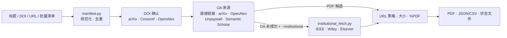

# oa-paper-fetch

**简体中文** | [English](README.md)

[](LICENSE)
[](#cli-参数)

> 论文标题 / DOI / URL → PDF 文件 + JSON/CSV 报告。

`oa-paper-fetch` 先确认论文身份并优先尝试开放获取（Open Access，OA）候选；只有用户明确启用学校访问后，才会复用由用户本人完成登录的浏览器会话，从 IEEE Xplore、Wiley Online Library 或 Elsevier ScienceDirect 获取用户有权访问的全文。Codex、Claude Code 和命令行共用同一套后端。

未指定保存位置时，论文默认进入 `~/Desktop/Papers`。学校登录会话在有效期内可以跨运行复用；工具不会读取、输入或保存学校账号、密码、MFA 验证码和恢复码。当前 CLI 版本为 `0.5.0`。

## 什么是 oa-paper-fetch？

- **一条入口接收真实参考文献。** 支持完整标题、DOI、URL、Markdown、CSV 和逐行纯文本。
- **论文身份确认。** 不凭记忆猜 DOI，不把分数最高的标题候选直接当成答案；只有两个来源确认同一 DOI 才接受纯标题输入。
- **文件与状态。** 重新检查下载 URL，校验文件大小和 `%PDF` 文件头，并保存清单、逐篇结果、待处理记录和续跑状态。

## 能力概览

| 能力 | 做什么 | 什么时候使用 |
| --- | --- | --- |
| Codex / Claude Code Skill | 把 AI 对话或参考文献清单转换成同一套清单驱动任务 | 下载代理刚刚找到或推荐的论文 |
| 单篇命令行 | 接收一个 `--title`、`--doi` 或 `--url` | 获取或诊断一篇已知论文 |
| 批量清单 | 规范化、校验、去重、报告并续跑 CSV、Markdown 或纯文本输入 | 批量下载并保留逐篇结果 |
| 可选学校访问 | OA 未成功后，复用用户已登录的 IEEE、Wiley 或 Elsevier 浏览器会话 | 获取用户本来就有权访问的论文 |

## 架构



## 快速开始

### Codex

安装到当前 Codex 用户级 Skill 目录：

```bash
SKILLS_HOME="${CODEX_HOME:-$HOME/.codex}/skills"
mkdir -p "$SKILLS_HOME"
git clone https://github.com/Eason412/paper-fetch.git \
  "$SKILLS_HOME/oa-paper-fetch"
```

如果已经安装，请在仓库目录执行 `git pull` 更新。Codex 没有发现 Skill 时，重启 Codex。

安装后可以直接说：

```text
使用 $oa-paper-fetch，把你刚才推荐的所有参考文献下载下来。
```

没有指定目录时保存到 `~/Desktop/Papers`。也可以覆盖本次位置：

```text
使用 $oa-paper-fetch，把这些论文下载到 /absolute/path/to/papers。
```

### Claude Code

Claude Code 支持项目级 `.claude/skills/<name>/SKILL.md`。正常克隆仓库后，从仓库目录启动 Claude Code，项目自带的 `.claude/skills/oa-paper-fetch/SKILL.md` 会路由到根 `SKILL.md`：

```bash
git clone https://github.com/Eason412/paper-fetch.git
cd paper-fetch
claude
```

调用方式：

```text
/oa-paper-fetch 把你刚才推荐的论文下载到默认目录
```

若希望所有 Claude Code 项目都能使用，可以把完整仓库安装到个人 Skill 目录：

```bash
mkdir -p "$HOME/.claude/skills"
git clone https://github.com/Eason412/paper-fetch.git \
  "$HOME/.claude/skills/oa-paper-fetch"
```

Claude Code 会按 `description` 自动选择 Skill，也可以显式使用 `/oa-paper-fetch`。如果运行中的 Claude Code 没有发现新创建的顶层 Skill 目录，请重新启动会话。目录约定见 [Claude Code 官方 Skills 文档](https://code.claude.com/docs/en/skills)。

根 `SKILL.md` 是 Codex 和 Claude Code 共同遵循的唯一操作契约；Claude 项目 Skill 只是薄路由。`oa_fetch.py` 和 `institutional_fetch.py` 是共享执行后端，不维护第二份 Claude 实现。

### 最短使用方式：只给论文标题

安装任一 Skill 后，可以直接交给代理完整的原始标题：

```text
请下载以下论文，保存到桌面；先找 OA，找不到时使用我已经配置好的学校访问：

1. Exact Full Paper Title One
2. Exact Full Paper Title Two
3. Exact Full Paper Title Three
```

代理会生成临时批量清单并运行后端。标题存在多个可信 DOI 时，不会自行挑选；结果会保留候选证据并要求补充 DOI、受支持的文章 URL 或更正后的完整标题。

### 直接运行一篇 OA 论文

OA 层需要 Python 3.10 或更高版本，不依赖第三方 Python 包。除非另有说明，后续手工执行的 CLI、依赖安装和测试命令都应从仓库根目录运行。下载一篇 OA 论文：

```bash
python3 oa_fetch.py \
  --url "https://arxiv.org/abs/1706.03762" \
  --format text
```

成功后，PDF 和报告位于 `~/Desktop/Papers`。如需启用 Unpaywall，在本机环境设置 `UNPAYWALL_EMAIL`；程序不会打印该变量的值。

## 工作流程

1. **整理清单。** Skill 把 AI 找到的参考文献原样写成 `id,title,doi,url` CSV；只知道标题时让 DOI 和 URL 留空，不凭记忆补写。
2. **规范化和去重。** 后端统一 DOI/URL 格式，优先按 DOI、其次按 URL 去重；标题相同但没有 DOI/URL 的记录只标记为疑似重复，不会静默合并。
3. **严格解析标题。** title-only 记录同时查询 arXiv、Crossref 和 OpenAlex。只有至少两个独立来源确认同一 DOI，并且每个候选标题都达到确认阈值，才会自动采用该 DOI；即使单一来源的标题完全一致，也仍然属于歧义状态，不下载“最像”的候选。
4. **优先获取 OA。** 依次尝试直接 PDF、确认后的 arXiv、OpenAlex、Unpaywall 和 Semantic Scholar 候选。
5. **按需使用学校访问。** OA 未成功且具备已确认 DOI 或原始 URL 的记录，可以进入已登录的 IEEE、Wiley 或 Elsevier 浏览器会话。任务已有预期标题时，出版商页面的 `citation_title` 必须再次匹配后才会请求 PDF。
6. **按书目信息准确命名。** 优先使用来源提供的年份、第一作者和完整标题；元数据不足时使用 arXiv ID、DOI、PII、IEEE 文档号或原始 URL 文件名，不再退化成只有 `rowN` 的名称。
7. **保存状态并支持恢复。** PDF、规范化清单、详细报告和恢复状态都写入输出目录；再次运行同一清单时跳过已经验证的 PDF，只重试未完成项目。
8. **安全分段。** 单次最多尝试 30 篇机构访问；超出的记录写入 `oa_fetch_pending.csv`，必须等用户再次要求后才能继续。

## PDF 命名

正常情况下，文件名采用：

```text
年份_第一作者_完整论文标题_8位稳定哈希.pdf
```

例如：

```text
2018_Devlin_BERT_Pre-training_of_Deep_Bidirectional_Transformers_for_Language_Understanding_8a24a8c5.pdf
```

书目信息只取自可核验来源：arXiv URL 会按 arXiv ID 查询 Atom 元数据；IEEE Xplore、ScienceDirect 和 Wiley 下载会读取当前文章页的 `citation_title`、`citation_author`、`citation_publication_date` 和 `citation_doi`。任务已有用户原始标题或由 DOI 锚定的预期标题时，页面必须提供可用的 `citation_title`，且两者规范化后必须一致或相似度达到 `0.93`。页面缺少标题或标题规范化后为空时返回 `publisher_title_unverifiable`，标题不一致时返回 `publisher_title_mismatch`；两种情况都不会请求 PDF，被拒绝的页面标题只保留在 `citation_title`，`title` 继续保留任务预期标题。对于没有预期标题、仅由显式 DOI 或 URL 锚定的任务，citation 标签缺失本身不会阻止下载，文件名会依次退化到已知标题、arXiv ID、DOI、PII、IEEE 文档号或 URL basename。

文件名末尾的哈希来自 canonical identity，同一篇论文跨运行保持稳定，不同论文即使同名也不会互相覆盖。目标名称已经被另一个文件占用时，程序保留现有 PDF 并报告 `filename_error`，不会覆盖任何一方。

## AI 批量清单

推荐让 AI 或 Skill 生成 UTF-8 CSV：

```csv
id,title,doi,url
ref-0001,Attention Is All You Need,10.48550/arXiv.1706.03762,https://arxiv.org/abs/1706.03762
ref-0002,Exact title known but DOI unknown,,
ref-0003,Exact publisher paper title,10.xxxx/yyyy,
```

字段含义：

| 字段 | 规则 |
| --- | --- |
| `id` | 任务内稳定且唯一，用于结果关联和恢复。缺失时后端生成 `rowN`；重复时追加序号。 |
| `title` | 保留来源中的原始标题，不根据记忆改写。 |
| `doi` | 可以是裸 DOI、`doi:` 前缀或 DOI URL；后端会规范化。 |
| `url` | 清单解析接受带主机名的 HTTP(S) URL；去除 fragment，不接受内嵌账号密码。实际下载前，OA URL 还必须使用 80/443 端口；机构回退只接受 HTTPS DOI 主机或白名单内的出版商主机。 |

`title`、`doi`、`url` 至少一个非空。只有标题时保留原始完整标题，并让 `doi`、`url` 留空；工具不会根据记忆补写缺失字段。

### 仅凭标题时如何确认论文身份

title-only 记录会查询 arXiv、Crossref 和 OpenAlex，并在 `oa_fetch_results.json` 中保留候选来源、候选标题、DOI、相似度、年份和第一作者。自动确认始终要求至少两个独立来源返回同一个规范化 DOI，并且每个候选标题的相似度不低于 `0.85`：

- 其中至少一个候选标题规范化后与输入标题完全一致时，原因记为 `exact_title`；
- 否则原因记为 `multiple_sources_same_doi`。

单一来源即使标题完全一致也不足以确认。较低阈值只用于发现候选，不足以触发下载。不同来源给出不同高置信 DOI 时，记录变为 `pending/title_resolution_ambiguous`；没有找到可信候选时，记录变为 `failed/title_resolution_unresolved`。这些情况都不会下载任意候选。

arXiv 的 `10.48550/arXiv.*` 仓储 DOI 有时与正式出版社 DOI 同时出现。只有 arXiv 标题与输入标题精确一致，并且至少两个独立来源共同确认同一个正式 DOI 时，工具才把该 arXiv DOI 记录为别名，同时保留 arXiv OA 地址；一个出版社来源不足以覆盖 arXiv DOI，两个不同的正式 DOI 也仍然会触发歧义阻断。别名和全部候选证据保留在 JSON 报告中。

标题应来自论文、检索结果或参考文献原文。中文翻译、简称、截断标题或“某某那篇论文”不适合作为无人值守输入；此时应补充 DOI、IEEE/Wiley/ScienceDirect 文章 URL，或完整原始标题。

批量下载：

```bash
python3 oa_fetch.py \
  --batch "/absolute/path/to/references.csv" \
  --format text
```

正常批量运行会自动在输出目录写入 `oa_fetch_manifest.csv`。该文件保留规范化后的唯一可执行输入，可用于再次运行和断点续跑。输入记录原本没有标题时，工具从已锚定 DOI、arXiv ID 或受支持出版商页面获得的来源标题可以补入清单中的空标题字段，供后续恢复和准确命名使用；解析出的 DOI 和候选证据仍只写入结果与状态，不会冒充用户原始输入回填清单。

只做离线规范化和去重，不发起标题查询或 PDF 下载：

```bash
python3 oa_fetch.py \
  --batch "/absolute/path/to/references.csv" \
  --manifest-out "/absolute/path/to/oa_fetch_manifest.csv"
```

`--manifest-out` 成功只说明输入清单可执行，不代表已经解析 DOI 或下载 PDF。

仍然支持：

- Markdown 表格：列名可以使用 `title`/`题名`、`url`/`链接`、`doi` 和 `id`/`标记`；
- CSV：支持相同字段及常见英文别名；
- 纯文本：每行一个 DOI、URL 或标题，忽略空行和以 `#` 开头的行。

## 保存一次配置

非敏感偏好保存在：

```text
~/.oa-paper-fetch/config.json
```

配置优先级固定为：

```text
本次显式 CLI 参数 > 本地配置 > 内置默认值
```

设置默认目录和 OA 论文条目间隔：

```bash
python3 oa_fetch.py \
  --out "$HOME/Desktop/Papers" \
  --oa-delay 1 \
  --save-config
```

把学校访问保存为 OA 失败后的长期偏好：

```bash
python3 oa_fetch.py \
  --institutional \
  --inst-delay 4 \
  --inst-jitter 3 \
  --max-institutional 30 \
  --save-config
```

以后不需要重复传这些参数。本次只使用 OA 时，用 `--oa-only` 临时覆盖：

```bash
python3 oa_fetch.py --batch refs.csv --oa-only
```

配置文件只允许以下字段：

| 配置 | 内置默认值 | 范围或行为 |
| --- | ---: | --- |
| `output_dir` | `~/Desktop/Papers` | 必须是展开 `~` 后的绝对路径。 |
| `oa_delay` | 1 秒 | 论文条目之间 0–60 秒。 |
| `timeout` | 30 秒 | 5–300 秒。 |
| `institutional` | `false` | 只有用户显式保存后才作为长期回退。 |
| `browser_profile` | `~/.oa-paper-fetch/profile` | 只保存 profile 路径，不保存其中的数据。 |
| `inst_delay` | 4 秒 | 4–86400 秒。 |
| `inst_jitter` | 3 秒 | 0–10 秒。 |
| `max_institutional` | 30 | 1–30 次机构尝试。 |
| `headless` | `false` | 仅复用已经验证可用的登录会话。 |

配置目录尽力设置为 `0700`，配置文件设置为 `0600`，并通过同目录临时文件原子替换。未知字段会被忽略；保存时只写白名单字段。配置中绝不能放入密码、MFA、Cookie、token、Authorization header 或 Playwright storage state。

## 学校机构访问

### 安装可选浏览器依赖

```bash
python3 -m pip install -r requirements.txt
python3 -m playwright install chromium
```

### 首次登录或刷新会话

```bash
python3 oa_fetch.py --institutional-login
```

程序会打开可见浏览器，并分别打开 IEEE Xplore、ScienceDirect 和 Wiley Online Library。用户需要在浏览器中自行选择学校机构访问并完成 SSO/MFA；程序不会点击或填写认证字段。确认网站登录完成后，回到终端按 Enter。

登录会话保存在 `~/.oa-paper-fetch/profile`。该目录包含敏感会话数据，只应留在本机；不要查看、同步、上传、分享或提交到 Git。

机构后端优先尝试 Playwright 管理的系统 Google Chrome channel，失败后尝试 Playwright Chromium。它使用独立持久化 profile，不会附着到已经打开的 Chrome，也不会复用日常 Chrome profile。

### 复用登录会话

一次性启用：

```bash
python3 oa_fetch.py \
  --batch "/absolute/path/to/references.csv" \
  --out "/absolute/path/to/papers" \
  --institutional \
  --format text
```

如果已经通过 `--save-config` 保存了 `institutional=true`，后续可省略 `--institutional`。`--headless` 只适合复用已经成功工作的 profile；首次登录和登录修复始终必须使用可见浏览器。

每次主 frame 的落地页重定向都会在请求发出前拦截，并且只能停留在 HTTPS DOI 或受支持出版商域名；越界重定向以 `unsafe_landing_redirect` 失败。工具不会根据上次登录时间推断会话仍有效。profile 缺失时，符合机构回退条件的记录变为 `pending/profile_missing_login_required`；落地页或 PDF 阶段出现登录墙，或任一阶段出现 HTTP 4xx 时，该记录变为 `pending/login_refresh_required`；任务存在预期标题但出版商页面没有标题时，记录变为 `pending/publisher_title_unverifiable`，标题不一致时则变为 `pending/publisher_title_mismatch`；自上次成功 PDF 以来在落地页或 PDF 阶段累计 3 次 HTTP 4xx 或 challenge 后，本轮机构阶段停止并提示重新登录。

### 下载节奏

OA 和机构阶段都串行处理：

| 阶段 | 默认节奏 | 可设置范围 |
| --- | ---: | ---: |
| OA 论文条目 | 每篇间隔 1 秒 | `--oa-delay 0–60` 秒 |
| 机构访问 | 4 秒基础延迟 + 0–3 秒随机延迟 | 基础延迟 4–86400 秒，jitter 0–10 秒 |

机构访问单次最多 30 篇。自上次成功 PDF 以来，落地页或 PDF 阶段累计出现 3 次 HTTP 4xx、challenge 或登录墙后停止。超过上限或因登录问题未执行的记录写入 `oa_fetch_pending.csv`；程序不会自动启动下一批。

## 断点续跑

每篇论文根据规范化 DOI、URL 或标题身份生成稳定的 8 位哈希后缀，避免不同论文因标题相同而覆盖。文件名总长度控制在 240 UTF-8 字节以内。

PDF、状态和报告均使用同目录临时文件后原子替换。重跑同一输出目录时：

1. 读取 `oa_fetch_state.json`；
2. 根据 canonical identity 定位上一份文件；
3. 检查文件存在、大小大于 5 字节且以 `%PDF` 开头；
4. 验证通过则返回 `exists`，通常不再发起网络请求；旧版状态第一次由命名规则升级时，可以只查询一次书目信息；
5. 文件缺失或损坏则重新下载；
6. 失败和 pending 项继续尝试，成功项保持跳过。

命名升级不会重新下载 PDF。后端先校验旧文件，再为新名称创建不覆盖的同 inode 硬链接；只有恢复状态已经原子写入新名称后才移除旧名称。若状态写入失败，则回滚新链接并保留旧文件。升级成功后，后续运行直接按新名称返回 `exists`。

继续整个任务：

```bash
python3 oa_fetch.py \
  --batch "/absolute/output/oa_fetch_manifest.csv" \
  --out "/absolute/output"
```

达到机构上限后，必须由用户再次明确要求，才能运行：

```bash
python3 oa_fetch.py \
  --batch "/absolute/output/oa_fetch_pending.csv" \
  --out "/absolute/output" \
  --institutional
```

同一输出目录不支持多个进程并发写入；一次只运行一个任务。

## 输出状态与文件

正常论文处理运行到最终报告阶段、manifest 预检成功写出结果时，以及单独成功保存配置时，stdout 会输出一个 JSON payload。`--format text` 只向 stderr 增加进度，不替换论文结果 payload。`--help`、`--version` 和 `--institutional-login` 使用便于阅读的文本输出；参数/配置错误以及较早发生的文件或写入失败可能在产生 JSON 前退出。

状态含义：

| 状态 | 含义 |
| --- | --- |
| `candidate` | dry-run 找到了候选地址，但没有下载 PDF。 |
| `downloaded` | 本轮成功下载并验证 PDF。 |
| `exists` | 状态记录中的 PDF 已存在且通过 `%PDF` 检查；除一次旧命名升级外，跳过网络。 |
| `duplicate` | 与前一条 DOI 或 URL 相同，结果关联到首条记录。 |
| `failed` | 标题无法解析、没有可下载 OA、出版商不支持或下载失败。 |
| `pending` | 论文身份有歧义、出版商标题不匹配或无法核验、需要登录刷新，或需要新的 30 篇机构批次。 |

需要人工处理的关键原因：

| 原因 | 下一步 |
| --- | --- |
| `title_resolution_ambiguous` | 查看 JSON 中的候选 DOI/标题，补充正确 DOI、受支持 URL 或更正后的完整标题。 |
| `title_resolution_unresolved` | 补充 DOI、受支持 URL 或准确的原始标题。 |
| `publisher_title_mismatch` | 核对任务预期标题与出版商 `citation_title`，不要直接重试同一歧义身份。 |
| `publisher_title_unverifiable` | 补充已核实 DOI 或受支持的文章 URL，或检查出版商页面为什么没有提供 `citation_title`。 |
| `profile_missing_login_required` | 用可见浏览器完成首次机构登录。 |
| `login_refresh_required` | 用可见浏览器刷新失效会话。 |
| `institutional_cap_reached` | 等用户下一次明确要求后，再运行 pending 清单。 |

输出目录可能包含：

- `*.pdf`：优先采用“年份_第一作者_标题”，并带 canonical identity 哈希后缀的论文；
- `oa_fetch_manifest.csv`：规范化、去重后的可执行清单；
- `oa_fetch_results.json`：完整元数据、标题候选、解析决策、下载尝试和机构结果；
- `oa_fetch_results.csv`：便于筛选的扁平摘要，包括 `title_resolution_status`、`title_resolution_reason`、`resolved_doi`、`expected_title`、`citation_title`、`publisher_title_match` 和 `publisher_title_score`；
- `oa_fetch_state.json`：跨运行恢复状态和尝试历史；
- `oa_fetch_pending.csv`：仅在需要显式继续时生成。

`--dry-run` 找到候选时可以返回 `success: true` 和退出码 `0`，但不会写 PDF，也不会写恢复状态。

## CLI 参数

| 选项 | 作用 |
| --- | --- |
| `--doi DOI` | 按 DOI 处理一篇论文。 |
| `--title TITLE` | 按完整标题进行多源身份确认，再处理一篇论文。 |
| `--url URL` | 处理含 DOI 的 URL、arXiv URL 或直接 PDF URL。 |
| `--batch PATH` | 读取 Markdown、CSV 或纯文本批量输入。 |
| `--out PATH` | 本次输出目录；未给出时使用配置或 `~/Desktop/Papers`。 |
| `--timeout SECONDS` | 请求超时，默认 30 秒。 |
| `--oa-delay SECONDS` | OA 论文条目间隔，默认 1 秒，范围 0–60 秒。 |
| `--config PATH` | 使用其他非敏感配置文件。 |
| `--save-config` | 保存本次显式给出的白名单偏好；可以不带论文输入单独运行。 |
| `--manifest-out PATH` | 与 `--batch` 一起使用，只做离线规范化和去重。 |
| `--overwrite` | 强制替换已有目标 PDF。 |
| `--dry-run` | 查询候选和写结果报告，但不下载 PDF。 |
| `--format json\|text` | 处理论文时，`text` 会向 stderr 增加进度，最终结果 payload 仍以 JSON 输出到 stdout。 |
| `--version` | 输出版本。 |
| `--institutional` | 本轮启用机构回退，也可与 `--save-config` 保存为长期偏好。 |
| `--oa-only` | 本轮关闭已配置的机构回退。 |
| `--institutional-login` | 打开可见的首次登录或会话刷新流程。 |
| `--browser-profile PATH` | 指定其他持久化 profile。 |
| `--inst-delay SECONDS` | 机构访问基础延迟，范围 4–86400 秒。 |
| `--inst-jitter SECONDS` | 增加 0–10 秒随机延迟。 |
| `--max-institutional N` | 单次机构尝试上限，范围 1–30。 |
| `--headless` / `--no-headless` | 设置已建立 profile 的可见性偏好。 |

运行 `python3 oa_fetch.py --help` 查看当前完整参数。

## 退出码

| 退出码 | 含义 |
| ---: | --- |
| `0` | 所有正常任务已解决；所有 dry-run 项目找到候选；或 manifest 预检产生至少一条可用记录。 |
| `1` | 至少一个正常任务仍为 `failed` 或 `pending`。 |
| `2` | CLI 或配置无效，包括非法范围、缺少选择器或登录时显式使用 headless。 |
| `3` | 批量文件不存在、输入为空，或 manifest 预检没有可用记录。 |
| `4` | 网络/传输异常，或输出、配置、状态、manifest、PDF、报告写入失败。 |

## 安全与访问边界

- OA 下载只接受标准端口上的 HTTP(S) URL，拒绝 localhost、常见本地域名空间、metadata 地址以及显式的私有、环回、链路本地、保留和组播 IP，并在每次重定向时重新检查 URL。
- 两个下载后端都把单个 PDF 限制在 80 MiB，并要求内容以 `%PDF` 开头后才原子写入。
- title-only 输入不会把最高相似度候选直接当成目标；身份冲突时不请求 PDF。
- 机构访问只允许 DOI 和 IEEE、Wiley、Elsevier 页面；最终 PDF 必须与文章页面属于同一家出版商。
- 不使用 Sci-Hub，不绕过付费墙，不自动处理 CAPTCHA，不轮换代理，不规避反爬措施。
- 不要把密码、MFA、恢复码、Cookie、API secret 或 token 放入清单、配置、命令、Issue 或日志。
- 本工具只适合用户本人有权访问的论文，不用于系统性采集或自动连续批量下载。

## 当前限制

- 机构访问只支持 IEEE Xplore、Wiley Online Library 和 Elsevier ScienceDirect。
- 普通文章网页不会通用解析；`--url` 可靠支持的是含 DOI 的 URL、arXiv URL 和直接 PDF URL。
- 仅标题输入依赖在线 arXiv、Crossref 和 OpenAlex 元数据；网络不可用、标题不完整或候选冲突时不会进入机构访问，需要补充 DOI 或受支持 URL。
- 任务已有预期标题但出版商页面缺少可用的 `citation_title` 时，记录保持为 `pending/publisher_title_unverifiable`；没有预期标题、仅由显式 DOI 或 URL 锚定的任务仍可使用该身份及文件名回退字段。
- 标题疑似重复只做规范化后的精确匹配，不做模糊自动合并。
- 出版商页面和登录策略可能变化；遇到登录墙时需要用户在可见浏览器中刷新会话。
- 程序不能附着到已经打开的 Chrome，也不会保存学校账号和密码。
- 没有定时守护进程；“下载间隔”指论文条目之间的节流，不是每天某个时刻自动启动。
- 同一输出目录不提供跨进程锁。
- 旧文件自动改名使用同目录硬链接；默认 macOS APFS 支持这一能力。若自定义输出目录位于不支持硬链接的 FAT/exFAT 等文件系统，PDF 仍保留在原名称，结果会报告 `filename_error`，不会退化为覆盖或删除原文件。
- OA URL 检查不把域名的 DNS 解析结果固定到后续连接；这是为了兼容会把公网域名映射到合成地址的 VPN/代理环境。不要把该 CLI 作为接收不受信任 URL 的公网下载服务。

## 开发与测试

离线测试覆盖配置优先级和权限、manifest 规范化与去重、严格 title-only DOI 确认、候选 DOI 冲突、出版商标题守卫、arXiv 精确元数据命名、IEEE/Wiley/Elsevier citation 元数据、无覆盖文件迁移、OA 优先编排、恢复和 pending、原子写入、URL/重定向安全、出版商边界、限速参数及 Codex/Claude Skill 契约：

```bash
python3 -m unittest discover -s tests -v
```

真实 OA 冒烟：

```bash
tmpdir="$(mktemp -d)"
python3 oa_fetch.py \
  --url "https://arxiv.org/abs/1706.03762" \
  --out "$tmpdir" \
  --oa-delay 0

# 再运行一次，结果状态应从 downloaded 变为 exists。
python3 oa_fetch.py \
  --url "https://arxiv.org/abs/1706.03762" \
  --out "$tmpdir" \
  --oa-delay 0
```

机构登录和真实出版商下载依赖用户学校权限，不属于离线测试。验证时应使用可见登录、小批量论文，并确认两次机构访问间隔不低于 4 秒。

项目结构：

```text
README.md                                 英文人类使用说明
README.zh-CN.md                           中文人类使用说明
AGENTS.md                                 AI 开发与维护手册
CLAUDE.md                                 Claude Code 到 AI 手册的薄路由
SKILL.md                                  共享的唯一下载操作与安全契约
.claude/skills/oa-paper-fetch/SKILL.md    Claude Code 下载 Skill 薄路由
agents/openai.yaml                        Codex Skill UI 元数据与默认提示
oa_fetch.py                               CLI、标题解析、OA 查询、报告和机构回退编排
institutional_fetch.py                    受限的 Playwright 会话与出版商标题核验
config.py                                 非敏感本地配置、校验和优先级
manifest.py                               参考文献规范化、去重和 canonical identity
store.py                                  稳定文件名、原子写入、恢复状态和 pending 清单
requirements.txt                          可选机构访问依赖
tests/                                    离线契约与边界测试
```

## 问题反馈与贡献

如需报告可复现问题或提出范围明确的改进，请创建 [GitHub Issue](https://github.com/Eason412/paper-fetch/issues)。请提供经过脱敏的命令、输入结构、退出码和错误名；不要上传浏览器 profile、Cookie、学校凭据或 token。

Pull Request 应保持 OA 优先、三家出版商白名单、机构硬限制和无凭据存储。项目由 [Eason412](https://github.com/Eason412) 维护，采用 [MIT License](LICENSE)。

使用 AI 修改仓库前，请先阅读 [AGENTS.md](AGENTS.md)；让 AI 执行论文下载任务时，以 [SKILL.md](SKILL.md) 为唯一操作契约。
